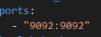
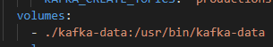
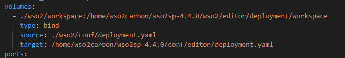
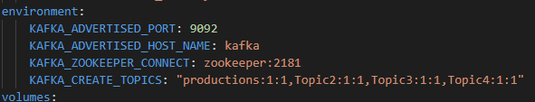
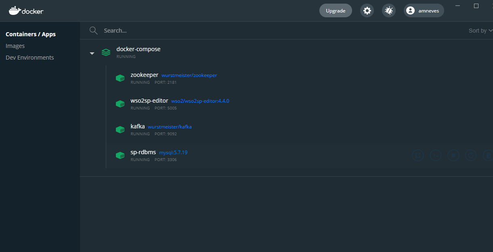
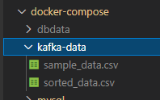

# Docker Resources for WSO2 Stream Processing

# Prerequisites
* Docker Desktop: https://www.docker.com/products/docker-desktop
* Git: https://git-scm.com/
* (optional) mysql workbench: https://www.mysql.com/products/workbench/
* Note: Some docker containers may not work if you are using an M1 macbook.

# Project structure

This repository is build to work fully with docker, which means you will not need to install any dependencies manually. It uses docker-compose to pull and run the needed containers, you can check the docker compose settings on the file `docker-compose.yml` inside the `./docker-compose/` folder.
More information about docker compose at https://docs.docker.com/compose/

There are 4 main services in the docker compose:
1. Wso2 editor;
2. Mysql database;
3. Kafka and zookeper.

These services are identified in the yml file as zookeeper, kafka, mysql, editor. Feel free to explore the `docker-compose.yml` file and identify the settings for each of these services.

## Local folder structure

Each docker container is isolated form your local host PC, nevertheless each of them have local folders mapped so we can change and presist data without having to go inside the containers manually. After running `docker-compose up` at least once, there will be 4 folders inside the `./docker-compose` directory. 

1. dbdata (mysql database files). This folder can be deleted to reset the mysql state;
2. kafka-data (make sure to put your project CSV files here, to publish to a kafka topic later);
3. mysql (mysql script that sets up the databases);
4. wso2 (contains the workspace and the editor configuration file).

## Changing docker compose settings

This repository uses the docker-compose.yml file in 'docker-compose' folder to setup the containers. This file starts all the containers, mounts your local volumes to the dockers, and exposes some docker ports. Check https://docs.docker.com/compose/ for more info.

You shouldn't need to mess with much settings here, but there are 3 important ones that could be usefull.
* Port mapping.
    * `host:container` 
    * Add any necessary port mapping to allow interacting with the docker containers from an outside source. Remember that docker containers are also connected via a docker compose default network, addressable by docker name. ex: `kafka:9092`. More info on docker compose networking at https://docs.docker.com/compose/networking/.
* Volume and file binding.
    If you wish to bind any other folder or files (so docker containers can see folders in your local PC) use the following examples (`localpath:containerpath`):
    * For folders: 
    * For single files: 
    * Warning: If you map a single file without the `type: bind` it will be overwritten with an empty directory.
* Environment variables.
    * 

If you do any changes to the docker compose settings you will need to run `docker-compose up` again. Docker will then reconstruct the changed containers. 

# How to deploy working environment
0. Open a terminal and chose your working directory
1. `git clone https://github.com/iamnives/docker-sp`
2. `cd .\docker-sp\docker-compose\`
    2.1 (for linux and mac) cd ./docker-sp/docker-compose/
3. `docker-compose up`
4. Wait for docker-compose to launch all the containers. Check with docker UI for a healty (green) status on all containers.
    * 
4. Open the wso2sp editor: http://localhost:9390/editor
5. Your working enviroments should be fully setup at this point. 

# Database setup
The mysql docker containers runs the script in `mysql/scripts/mysql.sql` after startup. This script already contains the SweetFactoryDB used in the 'Database integration'. it also creates a 'wso2carbon' user with password 'wso2carbon', this user has full permissions on the database. 

Feel free to add any aditional setup SQL code in this file (aditional tables, users, databases, etc...), just take into account that the code can run on docker compose even if the database already exists. 

When you do the database tutorials you can skip most of the "Before you begin" section. Just make sure the required database exists.

You are free to use mysql workbench to explor/change the databases and create new ones, change tables or view data. You can also use the mysql console inside the docker container by using the CLI button on docker UI on the container sp-rdbms or use the command "docker exec -it sp-rdbms /bin/bash".

## Important: Reseting the database server
You can delete the 'dbdata' folder on 'docker-compose/dbdata', this will delete everything about the database and it will be reconstructed on the next docker compose.

# Useful tutorials - https://docs.wso2.com/display/SP440/Tutorials
* Get used to the editor: https://docs.wso2.com/display/SP440/Creating+a+Simple+Siddhi+Application
* Consuming events from external source: https://docs.wso2.com/display/SP440/Consuming+Events
* Pre-process data: https://docs.wso2.com/display/SP440/Pre-processing+Streaming+Data
* Database integration: https://docs.wso2.com/display/SP440/Integrating+Datastores
* Capturing Changes from Data Stores: https://docs.wso2.com/display/SP440/Capturing+Changes+from+Data+Stores

## 

* Summarizing Stream Data - Short Term: https://docs.wso2.com/display/SP440/Summarizing+Stream+Data+-+Short+Term
* Streaming Data Summarization (Incremental Aggregation): https://docs.wso2.com/pages/viewpage.action?pageId=112390451
* Publishing Processed Events: https://docs.wso2.com/display/SP440/Publishing+Processed+Events
* Correlating Simple Events: https://docs.wso2.com/display/SP440/Correlating+Simple+Events

# Kafka integration
## Testing kafka
You may want to test the kafka connection by using the provided HelloKafka.siddhi example.
 1. Open and read the HelloKafka.siddhi example on wso2 editor
 2. Run HelloKafka.siddhi
 3. Open kafka CLI console in Docker or use `docker exec -it kafka /bin/bash`
    * 
 4. Inside the kafka cli: `cd usr/bin`
 5. Inside the kafka cli: `kafka-console-producer.sh --broker-list kafka:9092 --topic productions`

This will open an interactive kafka producer interface, publish events of the type: `{"name": "Jaffa Cake","amount": 2.0}`. Change the parameters around to make sure everything is working correcly. Effects of this will be seen on the wso2 editor console. Note that the alerts will only be sent for production batches with less than 10 amount. 

## Publishing Taxi data to a kafka topic from the CSV:
This section covers how to publish the CSV Taxi data to a kafka topic, which will be used to test and develop your work.
1. Make sure to put the csv files (found on the GDrive) under docker-compose/kafka-data/
    * 
2. Click "CLI" button on docker UI or use `docker exec -it kafka /bin/bash` in the command line
    * 
3. Inside the kafka cli: `cd usr/bin`
4. Run the the provided KafkaReceiveAndCount example on the editor.
5. Run on the kafka CLI: `kafka-console-producer.sh --bootstrap-server kafka:9092 --topic productions < kafka-data/sample_data.csv`
    * This command gets the csv data and publishes it to the topic "productions" on "kafka:9092"
    * You can use all the kafka scripts from this directory if you need.
6. Watch the terminal logs on the editor.

### Usefull Kafka scripts
1. Connect to kafka console through docker. 
2. cd usr/bin to find the following scripts

* See group ids: `kafka-consumer-groups.sh --bootstrap-server kafka:9092 --list`
* See kafka topics: `kafka-topics.sh --list --bootstrap-server kafka:9092`

* Interactive CLI record publisher: `kafka-console-producer.sh --broker-list kafka:9092 --topic productions`

* Read kafka topics: `kafka-console-consumer.sh --topic consume --from-beginning --bootstrap-server kafka:9092`

# Common errors (more will be added as they are found)

Wso2 editor does not connect to kafka

<pre>
Make sure to use 'kafka' as the url identifier and not 'localhost' or an IP. ex 'kafka:9092'
</pre>

Containers can not see eachother

<pre>
Containers are connected though the docker-compose default network. Use the address with the containter name instead of an IP address. ex: 'jdbc:mysql://sp-rdbms:3306'
</pre>

Stream sink does not recieve http requests

<pre>
Make sure to setup the source url as '0.0.0.0' instead of 'localhost'.
</pre>

Connection to mysql strore fails
~

<pre>
Make sure your store settigns are setup with the following attributes, address by name, useSSL=false, and correct password and user.
</pre>
<code>@store(type='rdbms', jdbc.url="jdbc:mysql://sp-rdbms:3306/SweetFactoryDB?useSSL=false", username="wso2carbon", password="wso2carbon" , jdbc.driver.name="com.mysql.jdbc.Driver")</code>

Linux: Docker container has no write premissions

<pre>
Run the following command on the needed folder (replace wso2 if needed): chmod a+rwx -E wso2/
</pre>

